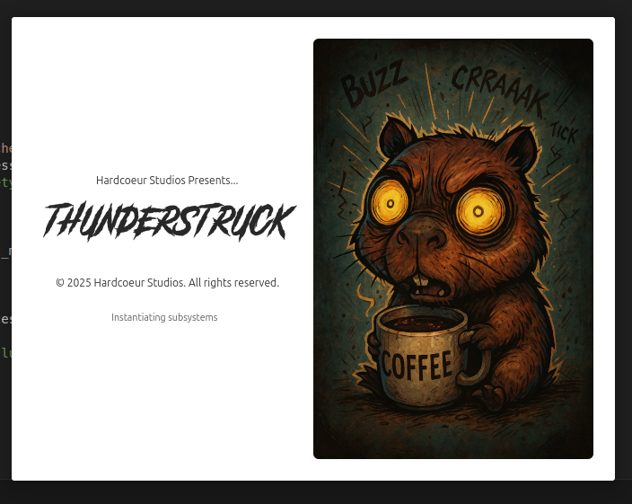
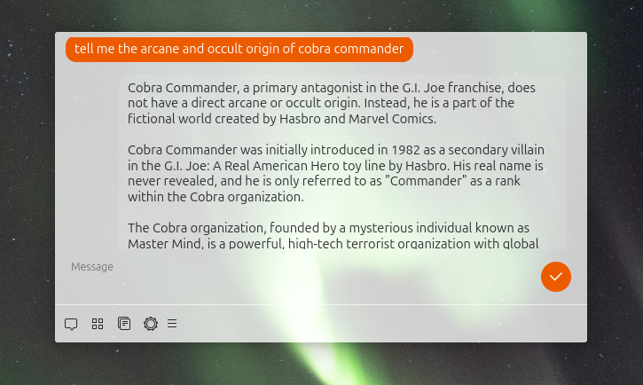
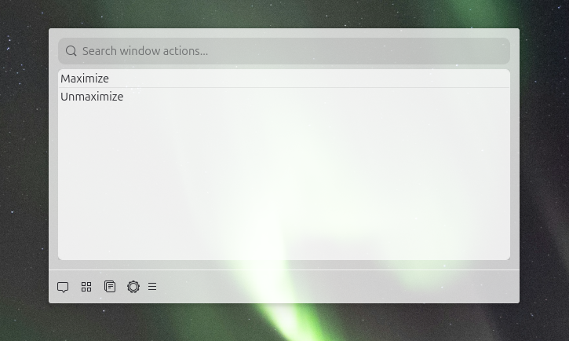

# Thunderstruck

Thunderstruck is a modular desktop launcher application for Linux, activated by a global keyboard shortcut, providing quick access to various functional modes.






## Features

*   **Global Activation:** Activate the main window instantly using a configurable global keyboard shortcut (default: `<Control><Alt>Space`).
*   **Modular Design:** Easily switch between different functionalities (modes) using the bottom mode switcher bar.
*   **GNOME Shell Integration:** Includes a status icon for quick access to toggle the window or quit the application.
*   **Welcome Screen:** Displays a brief loading/welcome screen on startup.
*   **Preferences Dialog:** Configure application settings, including the global shortcut and API keys for certain modes.
*   **Available Modes:**
    *   **Launcher:** Search and launch installed `.desktop` applications and executables found in your system's PATH, using ripgrep.
    *   **AI Chat:** Interact with AI models (supports Google Vertex AI and OpenRouter). Requires API keys configured in Preferences.
    *   **Window Management:** List open application windows.
    *   **Clipboard History:** View and manage recent text entries from your clipboard.

## Requirements

*   **Python 3**
*   **GTK4 & Libadwaita:** Ensure you have the necessary GTK4 and Libadwaita libraries installed for your distribution.
*   **Python Packages:** Install required packages using `pip install -r requirements.txt`. Key dependencies likely include `PyGObject`, `requests`, `google-cloud-aiplatform`, `pynput` (check `requirements.txt` for the exact list).
*   **Build Tools:**
    *   `blueprint-compiler` (for compiling `.blp` UI files)
    *   `glib-compile-schemas` (for compiling GSettings schemas)
    *   `glib-compile-resources` (for bundling resources)
*   **Runtime Tools:**
    *   `rg` (ripgrep) - Required by the Launcher mode for efficient searching.

## Installation / Setup

1.  **Clone the repository:**
    ```bash
    git clone <repository-url>
    cd thunderstruck
    ```
2.  **Install Python dependencies:**
    ```bash
    pip install -r requirements.txt
    ```
3.  **Compile Blueprint UI files:**
    ```bash
    find . -name '*.blp' -exec sh -c 'outfile=$(echo {} | sed 's/\.blp$/.ui/'); blueprint-compiler compile {} --output "$outfile"' \; {} \;
    ```
4.  **Compile GSettings schema:**
    ```bash
    glib-compile-schemas data/
    ```
5.  **Compile resources:**
    ```bash
    glib-compile-resources thunderstruck.gresource.xml --target=thunderstruck.gresource
    ```

## Usage

1.  **Run the application from the project root:**
    ```bash
    GSETTINGS_SCHEMA_DIR=data python run_app.py
    ```
    *(Ensure `data/` is the correct relative path to the compiled schemas)*

2.  **Activate the window:** Press the global shortcut (default: `<Control><Alt>Space`).

3.  **Use the GNOME Status Icon:** Click the status icon in the top bar to toggle the window visibility or quit the application.

## Configuration

Thunderstruck uses GSettings for configuration under the schema ID `org.example.Thunderstruck`.

Settings can be managed through the **Preferences** dialog, accessible via the menu button in the application's header bar. Configurable options include:

*   Global activation shortcut
*   API Keys (Google Vertex AI, OpenRouter) for the AI Chat mode
*   Maximum number of results for the Launcher mode

## Modes

*   **Launcher:** Type to search for applications (`.desktop` files) and executables in your PATH. Press Enter to launch the selected item.
*   **AI Chat:** Select a provider (Google Vertex AI or OpenRouter), enter your prompt, and interact with the AI model. API keys must be configured in Preferences.
*   **Window Management:** Displays a list of currently open application windows. (Functionality may expand in the future).
*   **Clipboard History:** Shows a list of recent text items copied to the clipboard. Select an item to copy it back to the clipboard.

##TODO

* Set a better schema ID
* Finish implementation of extension support.
* Add support for tools in the ai-chat
* Add support for document manipulation through the Launcher function, i.e select application -> select application action.
* Add more wmctrl exposed window manipulation, stacking etc.
